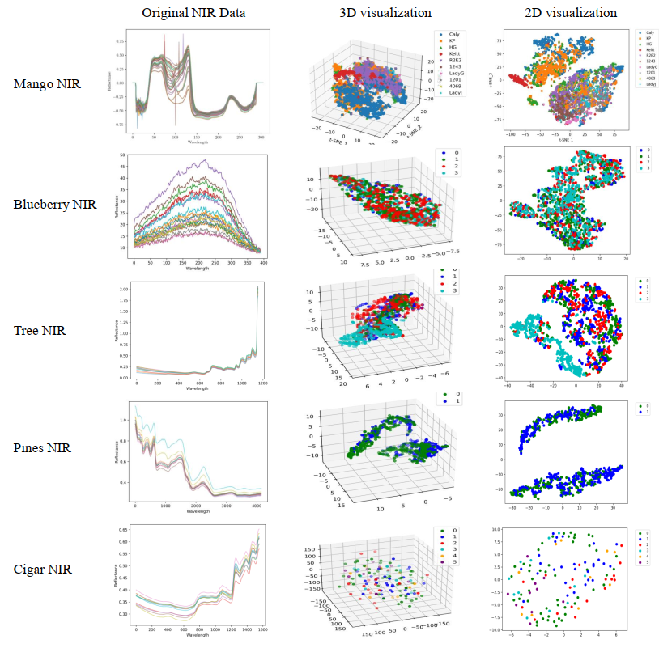
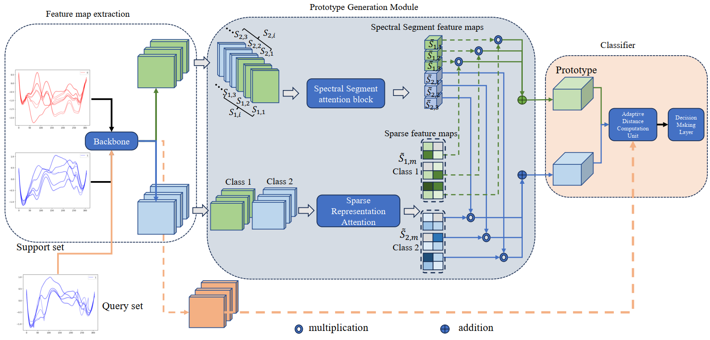

## Few-Shot Near-Infrared Spectral Classification Using Dual Attention and Adaptive Prototype Matching

### The implementation code will be released under an open-source license contingent upon formal acceptance of the accompanying manuscript for publication.

### Motivation

Conventional few-shot learning frameworks for spectral analysis 
typically employ fixed distance measures such as Euclidean or cosine similarity. While effective for simple feature distributions, these metrics are inadequate for near-infrared (NIR) spectra, which exhibit nonlinear wavelength dependencies, subtle inter-class variations, and domain-specific distribution shifts. Under such conditions, static metrics fail to adapt to the class-dependent geometry of spectral manifolds, resulting in inconsistent decision boundaries and poor generalization. To overcome these limitations, we reformulate few-shot spectral classification as a relation-driven learning problem, in which the similarity between query samples and class prototypes is modeled as a learnable, continuous, and class-conditional function rather than a predefined distance. This formulation allows the model to dynamically modulate relational strength according to spectral similarity, capturing smooth transitions between classes within a unified metric space. This motivation underlies the design of the proposed DAAPNet framework, which integrates spectrum-aware dual attention with an Adaptive Similarity Matching (ASM) module to achieve data-efficient, interpretable, and relation-aware few-shot learning for NIR spectral analysis.

### Dataset

| Dataset name          | No. of Samples | No. of Classes | Type of Class |
| --------------------- | -------------- | -------------- | ------------- |
| Mango Nir Dataset     | 10243          | 10             | Cultivar      |
| Blueberry Nir Dataset | 1350           | 4              | Acidity       |
| Tree Nir Dataset      | 1271           | 4              | Organ series  |
| Cigar Nir Dataset     | 384            | 6              | Origin        |

### The Architecture of Proposed Method

### Implement

We train the models in both n-way n-shot settings with standard normalization and augmentation techniques as in previous works \cite{pmlr-v70-finn17a}. The experiment utilizes a 5-way 5-shot configuration, with the model undergoing training for 100 epochs. During the model training phase, each epoch randomly selects five samples from the training set as the support set and one sample as the query set. This process is repeated a total of 600 times to establish 600 training episodes for training. In the testing phase, each epoch, the model will randomly select five samples from the test set as the support set and one sample as the query set, totaling 300 random selections. This process establishes 300 test episodes for training. This experimental parameter configuration ensures that the model can be trained stably in a few-shot scenario and fully learn the distinguishing features between categories through meta-learning.

### Experiments and Results

**Table: Performance of various few shot models on multiple datasets.**

| Model          | Mango Nir (1-shot) | Mango Nir (5-shot) | Pine Nir (1-shot) | Pine Nir (5-shot) | Tree Nir (1-shot) | Tree Nir (5-shot) |
| :------------- | :----------------: | :----------------: | :---------------: | :---------------: | :---------------: | :---------------: |
| LSTM-FCN       |        0.57        |        0.65        |       0.71        |       0.81        |       0.75        |       0.85        |
| MAML           |       0.598        |       0.694        |       0.73        |       0.82        |       0.83        |       0.93        |
| SCNN           |        0.78        |        0.86        |       0.79        |       0.91        |       0.91        |         1         |
| MsmcNet        |        0.72        |       0.831        |       0.80        |       0.91        |       0.90        |         1         |
| AMCRN          |        0.82        |        0.93        |       0.81        |       0.92        |       0.89        |         1         |
| EmoDSN         |       0.678        |       0.787        |       0.82        |       0.93        |       0.88        |         1         |
| **APMN (Our)** |      **0.83**      |      **0.96**      |     **0.83**      |     **0.965**     |     **0.91**      |       **1**       |

**Table: Performance of various few shot models on multiple datasets.**

| Model           | Blueberry Nir (1-shot) | Blueberry Nir (5-shot) | Cigar Nir (1-shot) | Cigar Nir (5-shot) |
| :-------------- | :--------------------: | :--------------------: | :----------------: | :----------------: |
| LSTM-FCN (2017) |          0.71          |          0.81          |        0.35        |        0.52        |
| MAML (2017)     |          0.78          |          0.86          |        0.38        |        0.55        |
| SCNN (2021)     |          0.80          |          0.91          |        0.44        |        0.60        |
| MsmcNet (2022)  |          0.81          |          0.92          |        0.45        |        0.62        |
| AMCRN (2022)    |          0.84          |          0.94          |        0.48        |        0.64        |
| EmoDSN (2023)   |          0.81          |          0.93          |        0.51        |        0.65        |
| **APMN (Our)**  |        **0.85**        |        **0.95**        |      **0.72**      |      **0.83**      |
